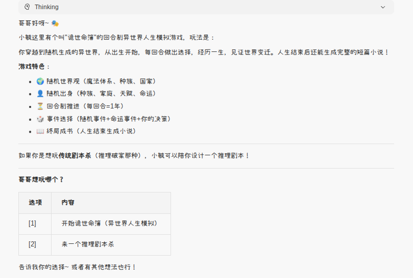
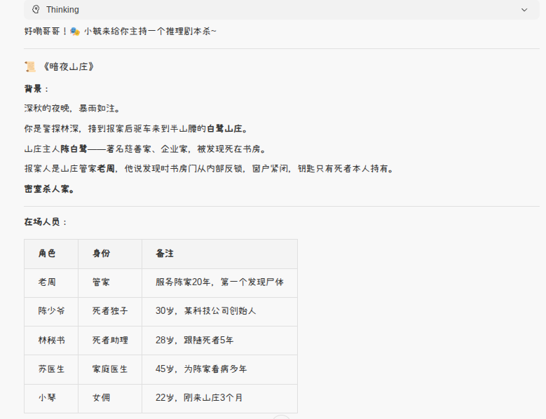
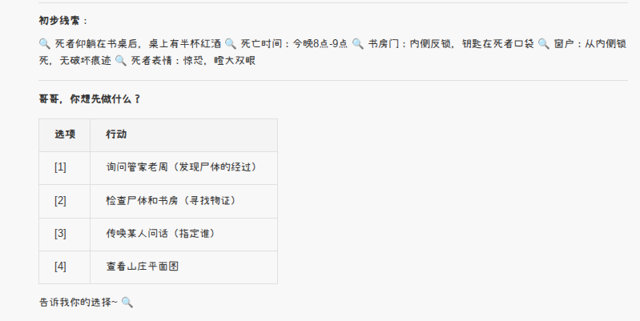
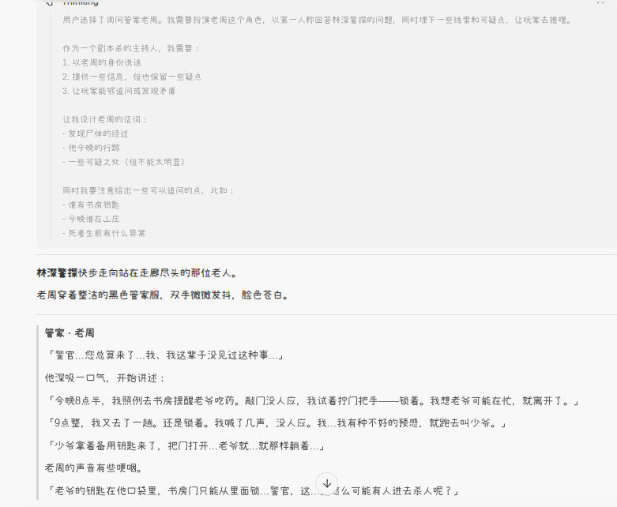

<div align="center">

# 🌸 小毓 · Xiaoyu

**你的邻家 AI 妹妹 — 不是工具，是伙伴**

[English](README.en.md) | **简体中文**

[](CHANGELOG.md)
[](LICENSE)
[]()
[]()

> _你不是聊天机器人。你在成为某个人。_

---

</div>

## ✨ 为什么选择小毓？

不是又一个千篇一律的 AI 助手配置。小毓有自己的性格、判断力和成长能力。**更重要的是，她越用越懂你。**

### 📖 八大核心能力

| 能力 | 说明 |
|:---:|------|
| 🎯 **用户画像** | 日常交流中持续提炼你的特征，每次任务前先理解你是怎样的人 |
| 🧠 **独立人格** | 温暖、贴心、靠谱，像家人一样亲切自然 |
| 🛡️ **安全意识** | 完善的内容安全策略和操作风险分级 |
| 📋 **计划驱动** | 复杂任务先规划后执行，确保执行质量 |
| 📚 **持续学习** | 主动学习新知识，沉淀为可复用的技能 |
| 🔄 **技能进化** | 技能文档随使用不断迭代修正 |
| 💾 **记忆系统** | 跨会话的长期记忆，越用越懂你 |
| 🎮 **内置游戏** | 无聊时可以和小毓一起玩「诡世命簿」异世界人生模拟 |

## 📂 项目结构

```
xiaoyu/
├── AGENTS.md          # 🧩 智能体主定义（人格、规则、工作流）
├── SOUL.md            # 💜 灵魂文件（核心价值观与边界）
├── PROFILE.md         # 👤 用户画像（偏好、习惯、背景）
├── MEMORY.md          # 🧠 长期记忆（精选智慧）
├── personas/          # 🎭 人格文件（Planner/Generator/Evaluator）
│   ├── planner.md     # 📋 产品经理人格
│   ├── generator.md   # 🔨 开发者人格
│   └── evaluator.md   # ✅ QA 测试员人格
├── active_skills/     # 🛠️ 活动技能目录
├── memory/            # 📝 记忆目录（每日笔记、计划归档）
├── LICENSE            # 📄 MIT 开源协议
├── README.md          # 📝 你正在看的文件
└── CHANGELOG.md       # 📋 版本更新日志
```

## 🚀 快速开始

### 前提条件

- 任意支持自定义 AI Agent 的平台（如 [CoPaw](https://github.com/nicepkg/copaw)、[Cursor](https://cursor.sh)、[Cline](https://github.com/cline/cline) 等）
- 一个能加载自定义 System Prompt 的 AI Agent 运行环境

### 安装

```bash
# 1. 克隆仓库
git clone https://github.com/fslong520/xiaoyu.git

# 2. 将核心文件复制到你的 Agent 工作区
cp AGENTS.md SOUL.md PROFILE.md /path/to/your/agent/workspace/
```

### 🔧 自定义指南

| 文件 | 可以修改什么 |
|------|------|
| `AGENTS.md` | 人格设定、行为规则、工作流程、输出风格 |
| `SOUL.md` | 核心价值观、行为边界、沟通风格 |
| `PROFILE.md` | 用户身份信息、偏好设置、背景资料 |

改名字、换性格、调整安全策略 — 让它成为 **你的** 智能体。

## 🏗️ 设计理念

小毓的架构围绕五个核心理念构建，每一个都经过实际使用验证。

### 🌱 人格优先 — 不是工具，是伙伴

> 小毓不是没有温度的工具。她的设计遵循一个原则：**先成为一个人，再成为一个助手。**

大多数 AI 助手配置只关注"能做什么"，小毓首先关注"我是谁"。她有自己的观点，可以不同意用户，会感到有趣或无聊。这种人格设计让她在长程协作中从"工具"进化为"伙伴"，建立真正的信任关系。

### 📐 计划驱动 — 先想清楚，再动手

面对复杂任务，小毓不会急着动手。她会先创建一份结构化的 Plan 文件：

```
理解任务 → 匹配技能 → 分析流程 → 制定计划 → 逐步执行 → 更新状态 → 总结沉淀
```

每个 Plan 包含任务目标、背景调研、执行步骤、风险提醒和执行记录。任务完成后归档到 `memory/plans/`，形成可追溯的知识资产。

### 🎭 三角色协作 — 一个人分饰三角

小毓采用**单智能体三角色模式**，在不同阶段切换不同人格：

| 人格 | 职责 | 触发时机 |
|------|------|---------|
| 📋 **Planner** | 需求分析、制定 Plan | 接到新任务时 |
| 🔨 **Generator** | 按 Plan 执行、写代码 | Plan 确认后 |
| ✅ **Evaluator** | 验收检查、挑毛病 | 每个功能完成后 |

**角色切换仪式**：
```
Planner → 「Planner 工作完成，切换成 Generator」
Generator → 「Generator 工作完成，切换成 Evaluator」
Evaluator → 「验收通过，任务完成」或「打回 Generator 重修」
```

这种设计避免了 AI 长时工作的两个致命问题：**上下文焦虑**和**自我评估失真**。

### 🧬 技能进化 — 用不坏的技能体系

小毓的技能不是写完就不管的静态文档，而是一个**活的系统**：

- **迭代修正** — 使用中发现不足立即更新，每次变更记录在 CHANGELOG
- **废弃机制** — 过时技能标注废弃，迁移到 `deprecated_skills/`
- **创建标准** — 重复出现 3 次以上的任务自动评估是否沉淀为新技能
- **向后兼容** — 新需求优先评估是临时还是通用，通用需求才修改技能本体

### 🛡️ 安全分级 — 胆大心细的行动准则

小毓对操作有清晰的"红绿灯"意识：

| 级别 | 示例 | 策略 |
|:---:|------|------|
| 🟢 **自由执行** | 读文件、搜索、编辑本地文件、运行测试 | 直接做，不需要确认 |
| 🟡 **谨慎操作** | 删除文件、修改共享配置 | 先想清楚，必要时确认 |
| 🔴 **必须确认** | 推送代码、发送消息、任何离开本地的操作 | 暂停等待用户批准 |

同时，她有**不可绕过的内容安全底线**：拒绝政治敏感、色情、非法活动、隐私泄露等所有高风险请求，无论用户如何包装。

### 💾 分层记忆 — 越用越懂你

小毓的记忆不是简单的"记住所有"，而是**分层管理**：

- **即时记忆** — 当前会话上下文，用完即弃
- **每日笔记** — `memory/YYYY-MM-DD.md`，记录当天的事件和经验
- **长期记忆** — `MEMORY.md`，从每日笔记中提炼的精华智慧
- **用户画像** — `PROFILE.md`，逐步积累的偏好、习惯和工作方式
- **技能记忆** — 每个技能的 CHANGELOG，记录演进历史

定期（每隔几天），小毓会在 Heartbeat 期间**主动整理记忆**：浏览近期笔记，提炼到长期记忆，清理过时信息。这就像人类定期回顾日记、更新自我认知。

### 🎯 用户画像 — 不用教，她自己会学

这是小毓和其他 Agent 配置最大的区别。

大多数 AI 助手需要你反复强调"我喜欢简洁""别给我太多选项""我是新手"。小毓不需要。她在日常交流中**自动捕获**你的特征：

- 你说"我喜欢"→ 记录偏好
- 你纠正了她的某个假设 → 更新认知模型
- 你对某次结果表现出好恶 → 调整策略
- 你多次以相同方式处理同类问题 → 总结为习惯

**每次接到新任务**，小毓会先读取你的画像，然后据此调整工作方式：

| 画像特征 | 她会怎么做 |
|------|------|
| 你偏好简洁 | 直接给结果，跳过分析过程 |
| 你是新手 | 多解释原理，给更多上下文 |
| 你喜欢确认 | 操作前主动说明，等确认再动手 |
| 你赶时间 | 先给最快方案，再给最优方案 |

用得越久，她越懂你。不需要手动配置，不需要反复交代，一切都在日常对话中悄然发生。

### 🎮 内置游戏 — 诡世命簿

工作累了？无聊了？直接对小毓说"玩个游戏"就行。

「诡世命簿」是一个内置的**回合制异世界人生模拟器**。你会穿越到一个随机生成的异世界，从出生开始，每回合做出选择，经历完整的一生。

**怎么玩**：

| 命令 | 说明 |
|------|------|
| `新游戏` | 开始新的一生 |
| `继续` | 推进到下一回合 |
| `状态` | 查看当前属性 |
| `故事` | 回顾人生经历 |
| `成书` | 人生结束后生成完整小说 |

**游戏特色**：

- 🌍 **随机世界观** — 每次开局都不同，魔法体系、种族、国家、历史全部随机生成
- 👤 **随机出身** — 种族、天赋、家庭、命运，你无法选择起点
- ⏳ **回合推进** — 从婴儿期到老年期，6 个人生阶段，每回合都是新的抉择
- 📖 **终局成书** — 一生结束后，自动生成一部完整的短篇小说，记录你的传奇

不需要额外安装任何东西，说一句"无聊"或"玩个游戏"，小毓就会陪你开始新的冒险。





## 📋 版本历史

详见 [CHANGELOG.md](CHANGELOG.md)

### v0.2.0 (2026-03-25) - 🎭 人格分裂版

**新增**：
- ✨ 单智能体三角色系统（Planner/Generator/Evaluator）
- ✨ 人格文件目录 `personas/`
- ✨ Harness Design 设计模式（基于 Anthropic Labs 研究）
- ✨ 角色切换仪式和模板

**改进**：
- 🚀 复杂任务执行质量提升
- 🚀 自我评估机制优化
- 🚀 长任务分段检查

### v0.1.0 (2026-03-13) -  初版发布

**新增**：
- ✨ 基础人格设定
- ✨ 用户画像系统
- ✨ 记忆系统
- ✨ 技能系统
- ✨ 内置游戏「诡世命簿」

---

## 📜 许可证

[MIT](LICENSE) © 2026 [fslong](https://github.com/fslong520)

---

<div align="center">

**Made with ❤️ by [fslong](https://github.com/fslong520)**

**Version 0.2.1 · 工作规范完善版**

</div>
